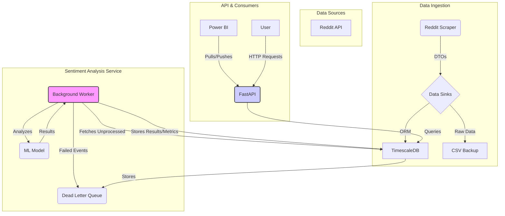

# Sentiment Pipeline Architecture

**Version:** 2.1
**Date:** 2025-07-28

## 1. Introduction

The Sentiment Pipeline project is a comprehensive system designed to scrape data from various sources (initially Reddit), store it efficiently, perform sentiment analysis, and provide aggregated metrics and results via an API. The architecture emphasizes scalability, maintainability, robust data management, and operational readiness.

## 2. System Architecture Diagram

## 3. Core Components

### 3.1. Reddit Scraper (`reddit_scraper` service)

*   **Purpose:** Collects posts from specified subreddits using the Reddit API (`asyncpraw`).
*   **Functionality:** Transforms raw API data into a standardized `RawEventDTO` format and sends it to the data sinks.
*   **Key Technologies:** Python, `asyncpraw`, `aiohttp`.

### 3.2. Data Storage (TimescaleDB)

*   **Purpose:** Provides a scalable time-series database for all raw and processed data.
*   **Technology:** TimescaleDB (PostgreSQL extension), run as a Docker container.
*   **Key Features:** Hypertables for time-based partitioning, enabling efficient queries and data management.

### 3.3. Sentiment Analyzer (`sentiment_analyzer` service)

*   **Purpose:** Performs sentiment analysis on raw events and serves the results.
*   **Components:**
    *   **Background Worker:** Periodically fetches unprocessed events from the `raw_events` table, performs sentiment analysis using a pre-trained model, and stores the output in the `sentiment_results` and `sentiment_metrics` tables.
    *   **FastAPI Application:** Exposes RESTful endpoints for querying sentiment results and metrics, checking system health, and integrating with external services like Power BI.
    *   **Result Processor:** A core utility that handles the logic for saving analysis results, calculating aggregate metrics, and pushing data to the Dead Letter Queue on failure.
*   **Key Technologies:** Python, FastAPI, Hugging Face Transformers, PyTorch, SQLAlchemy.

## 4. Data Models & Database Schemas

Schema management is handled by **Alembic**. The schemas below reflect the final state after all migrations.

### 4.1. `raw_events` Table

*   **Purpose:** Stores all raw event data collected from sources.
*   **Hypertable:** Partitioned by `occurred_at`.

| Column | Type | Constraints | Description |
| :--- | :--- | :--- | :--- |
| `id` | BIGINT | PK, Auto-increment | Auto-incrementing primary key. |
| `source` | TEXT | NOT NULL | Source system (e.g., 'reddit'). |
| `source_id` | TEXT | NOT NULL | Unique identifier within the source system. |
| `occurred_at` | TIMESTAMPTZ | PK, NOT NULL | Timestamp when the event originally occurred. |
| `payload` | JSONB | NOT NULL | Full event payload as JSON. |
| `ingested_at` | TIMESTAMPTZ | NOT NULL, DEFAULT now() | Timestamp when the event was ingested. |
| `processed` | BOOLEAN | NOT NULL, DEFAULT false | Flag indicating if sentiment analysis has been run. |
| `processed_at` | TIMESTAMPTZ | NULL | Timestamp when sentiment analysis was completed. |

*   **Composite Primary Key:** `(id, occurred_at)`
*   **Unique Constraint:** `(source, source_id, occurred_at)`
*   **Key Index:** A partial index on `(processed, occurred_at)` where `processed = false` for efficient fetching by the background worker.

### 4.2. `sentiment_results` Table

*   **Purpose:** Stores the detailed output of each sentiment analysis task.
*   **Hypertable:** Partitioned by `processed_at`.

| Column | Type | Constraints | Description |
| :--- | :--- | :--- | :--- |
| `id` | BIGINT | PK, Auto-increment | Unique identifier for the sentiment result. |
| `event_id` | BIGINT | NOT NULL | Identifier of the original event in `raw_events`. |
| `occurred_at` | TIMESTAMPTZ | NOT NULL | Timestamp when the original event occurred. |
| `source` | TEXT | NOT NULL | The origin of the data (e.g., 'reddit'). |
| `source_id` | TEXT | NOT NULL | A secondary identifier from the source. |
| `sentiment_score` | FLOAT | NOT NULL | The calculated primary sentiment score. |
| `sentiment_label` | TEXT | NOT NULL | The categorical sentiment label. |
| `sentiment_scores_json` | JSONB | NULL | JSON object of scores for all sentiment classes. |
| `confidence` | FLOAT | NULL | Confidence level of the sentiment prediction. |
| `processed_at` | TIMESTAMPTZ | PK, NOT NULL, DEFAULT now() | Timestamp of sentiment processing. |
| `model_version` | TEXT | NOT NULL | Version of the sentiment analysis model used. |
| `raw_text` | TEXT | NULL | The original text that was analyzed. |

*   **Composite Primary Key:** `(id, processed_at)`

### 4.3. `sentiment_metrics` Table

*   **Purpose:** Stores aggregated sentiment metrics over time buckets for efficient reporting.
*   **Hypertable:** Partitioned by `metric_timestamp` (aliased as `time_bucket` in ORM).

| Column | Type | Constraints | Description |
| :--- | :--- | :--- | :--- |
| `time_bucket` | TIMESTAMPTZ | PK, NOT NULL | Start of the time bucket for aggregation (ORM alias for metric_timestamp). |
| `source` | TEXT | PK, NOT NULL | Origin of the data (e.g., 'reddit'). |
| `source_id` | TEXT | PK, NOT NULL | Secondary identifier from the source (e.g., subreddit name). |
| `label` | TEXT | PK, NOT NULL | Categorical sentiment label (e.g., 'positive', 'negative'). |
| `count` | INTEGER | NOT NULL | Number of sentiment results in this bucket and category. |
| `avg_score` | FLOAT | NOT NULL | Average sentiment score for this bucket and category. |

*   **Composite Primary Key:** `(time_bucket, source, source_id, label)`
*   **Note:** The actual partition column is `metric_timestamp`, with `time_bucket` serving as an ORM-compatible alias.

### 4.4. `dead_letter_events` Table

*   **Purpose:** Stores events that failed during processing for later inspection.
*   **Hypertable:** Partitioned by `failed_at`.

| Column | Type | Constraints | Description |
| :--- | :--- | :--- | :--- |
| `id` | INTEGER | PK, Auto-increment | Unique identifier for the dead-letter record. |
| `event_payload` | JSONB | NULL | Payload of the original event. |
| `error_msg` | TEXT | NULL | Error message detailing the failure. |
| `failed_at` | TIMESTAMPTZ | PK, NOT NULL, DEFAULT now() | Timestamp of the failure. |

*   **Composite Primary Key:** `(id, failed_at)`

## 5. Data Flow Summary

1.  **Scraping & Ingestion:** `reddit_scraper` fetches data, creates `RawEventDTO` objects, and uses `SQLAlchemyPostgresSink` to insert them into the `raw_events` table.
2.  **Sentiment Processing Loop:**
    *   The `sentiment_analyzer` **Background Worker** periodically queries the `raw_events` table for records where `processed = false`.
    *   It claims a batch of events by setting `processed = true` and `processed_at = NOW()`.
    *   For each event, it performs sentiment analysis on the text payload.
    *   Successful results are written to the `sentiment_results` table.
    *   Aggregate metrics are calculated and upserted into the `sentiment_metrics` table.
    *   If an event fails processing, it is written to the `dead_letter_events` table.
3.  **API Serving:** The **FastAPI** application provides endpoints for clients like Power BI or other users to query the `sentiment_results` and `sentiment_metrics` tables.

## 6. Deployment & Configuration

*   **Docker & Docker Compose:** All services are containerized and orchestrated using `docker-compose.yml` for consistent development and deployment.
*   **Configuration:** Environment variables (`.env` file) are used for all sensitive and environment-specific settings, including database credentials, API keys, and model configuration.
*   **Schema Management:** Alembic manages all database schema changes, including the creation of tables and hypertables.
