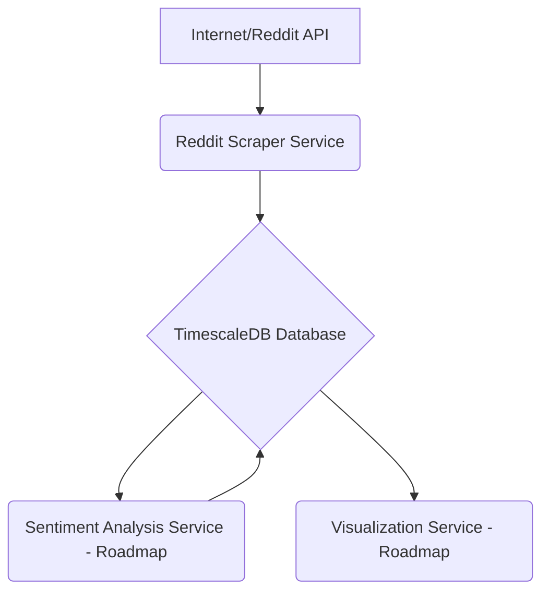

# Sentiment Pipeline Project

**Version:** 0.1.0
**Status:** In Development

This project aims to build a comprehensive pipeline for collecting data from Reddit, performing sentiment analysis, and visualizing the results. Currently, it includes a Reddit scraper and a TimescaleDB database for storing the collected data.

## Table of Contents

-   [Project Overview](#project-overview)
-   [Architecture](#architecture)
-   [Services](#services)
    -   [Reddit Scraper](#1-reddit-scraper)
    -   [TimescaleDB](#2-timescaledb)
    -   [Sentiment Analysis Service (Roadmap)](#3-sentiment-analysis-service-roadmap)
    -   [Visualization Service (Roadmap)](#4-visualization-service-roadmap)
-   [Prerequisites](#prerequisites)
-   [Getting Started](#getting-started)
    -   [1. Clone the Repository](#1-clone-the-repository)
    -   [2. Environment Configuration](#2-environment-configuration)
    -   [3. Build and Run with Docker Compose](#3-build-and-run-with-docker-compose)
    -   [4. Initial Database Setup (TimescaleDB with Alembic)](#4-initial-database-setup-timescaledb-with-alembic)
-   [Usage](#usage)
-   [Project Structure](#project-structure)
-   [Contributing](#contributing)
-   [License](#license)
-   [Live Dashboards](#live-dashboards)

## Project Overview

The Sentiment Pipeline is designed to:
1.  **Collect:** Fetch Reddit submissions from specified subreddits using the `reddit_scraper` service.
2.  **Store:** Persist the collected time-series data efficiently in a `TimescaleDB` database, optimized for large volumes and time-based queries.
3.  **Analyze (Roadmap):** Process the stored data to determine sentiment scores using a dedicated `sentiment_analysis_service`.
4.  **Visualize (Roadmap):** Present the data and sentiment analysis results through a `visualization_service` or dashboard.

This project leverages Docker and Docker Compose for easy setup, development, and deployment of its microservices.

## Architecture

The system is designed as a set of containerized microservices communicating over a Docker network. 

-   The **Reddit Scraper** fetches data and sends it to TimescaleDB.
-   **TimescaleDB** acts as the central data store for time-series submission data.
-   Future services for sentiment analysis and visualization will connect to TimescaleDB to read data and potentially write back analytical results.



## Architecture Overview

For a detailed explanation of the project architecture, data models, and component interactions, please see [ARCHITECTURE.md](ARCHITECTURE.md).

The project utilizes a modular design with the following key components:
*   **Scrapers:** (e.g., `reddit_scraper`) Responsible for collecting data from various sources.
*   **Common Modules:** Shared utilities, DTOs (`RawEventDTO`), and ORM models (`RawEventORM`).
*   **TimescaleDB:** A PostgreSQL database with the TimescaleDB extension for storing time-series data in the `raw_events` hypertable.
*   **Alembic:** Manages database schema migrations.
*   **Docker & Docker Compose:** For containerization and orchestration.

### Database Schema (`raw_events` table)

## Live Dashboards

Real-time and historical sentiment are visualised in Power BI using a *hybrid* push-dataset + DirectQuery model. See [`sentiment_docs/POWERBI.md`](sentiment_docs/POWERBI.md) for setup instructions.

The primary table for storing all collected data is `raw_events`. It is a TimescaleDB hypertable partitioned by the `occurred_at` timestamp.

**For the detailed schema definition, primary key, unique constraints, and ORM model, please refer to the [Data Model section in ARCHITECTURE.md](ARCHITECTURE.md#3-data-model).**

Key fields include:
*   `id` (TEXT): Source-specific unique ID.
*   `occurred_at` (TIMESTAMPTZ): Event timestamp (partition key).
*   `source` (TEXT): Data source (e.g., 'reddit').
*   `payload` (JSONB): Raw event data.

## Services

### 1. Reddit Scraper

-   **Directory:** `reddit_scraper/`
-   **Purpose:** Fetches Reddit submissions and comments from specified subreddits.
-   **Key Features:** Historical backfilling, continuous monitoring of new posts, configurable subreddits and data fields.
-   **Documentation:** See `reddit_scraper/README.md` and `reddit_scraper/prd.md`.

### 2. TimescaleDB

-   **Directory:** `timescaledb/` (for documentation like `prd.md`, `todo.md`)
-   **Purpose:** Stores all collected time-series data in the `raw_events` hypertable.
-   **Key Features:** Optimized for time-series data, supports SQL queries, managed by Alembic migrations.
-   **Documentation:** For detailed schema, setup, and integration, see [ARCHITECTURE.md](ARCHITECTURE.md) and [timescaledb_integration_guide.md](timescaledb_integration_guide.md). Component-specific details are in `timescaledb/prd.md` and `timescaledb/todo.md`.

### 3. Sentiment Analysis Service (Roadmap)

-   **Directory:** `sentiment_service/` (to be created)
-   **Description:** This service will be responsible for consuming raw text data (e.g., submission titles, selftext) from TimescaleDB, performing sentiment analysis using NLP models, and potentially storing the sentiment scores back into the database or a new table.
-   **Status:** Planned. Details will be added as development progresses.

### 4. Visualization Service (Roadmap)

-   **Directory:** `visualization_service/` (to be created)
-   **Description:** This service will provide a way to visualize the collected data and sentiment analysis results, possibly through dashboards or charts (e.g., using Grafana, a custom web app with Plotly/Dash, etc.).
-   **Status:** Planned. Details will be added as development progresses.

## Prerequisites

Before you begin, ensure you have the following installed:

-   [Docker](https://www.docker.com/get-started)
-   [Docker Compose](https://docs.docker.com/compose/install/)
-   [Git](https://git-scm.com/)

## Getting Started

Follow these steps to get the Sentiment Pipeline project up and running.

### 1. Clone the Repository

```bash
git clone <repository_url>
cd sentiment_pipeline
```

### 2. Environment Configuration

This project uses `.env` files to manage configuration and secrets. Example files are provided, which you should copy and customize.

1.  **Docker Compose Environment (`.env`):**
    This file is used by `docker-compose.yml` primarily for configuring the TimescaleDB service.
    ```bash
    cp .env.example .env
    ```
    Edit `.env` and set your desired `PG_USER`, `PG_PASSWORD`, and `PG_DB` for the TimescaleDB instance.

2.  **Reddit Scraper Environment (`scraper.env`):**
    This file configures the `reddit_scraper` service, primarily for its **Reddit API credentials** and the **database connection details it needs when running inside its Docker container** (to connect to the `timescaledb` service).
    ```bash
    cp scraper.env.example scraper.env
    ```
    Edit `scraper.env`:
    *   Fill in your `REDDIT_CLIENT_ID`, `REDDIT_CLIENT_SECRET`, `REDDIT_USERNAME`, `REDDIT_PASSWORD`, and `REDDIT_USER_AGENT`.
    *   Ensure `PG_HOST` is set to `timescaledb` (the service name of the TimescaleDB container).
    *   Ensure `PG_PORT` is set to `5432`.
    *   Ensure `PG_USER`, `PG_PASSWORD`, and `PG_DB` match the values you set in the main `.env` file (e.g., `test_user`, `test_password`, `sentiment_pipeline_db`). These are used by the scraper application and Alembic when run from the scraper's container.
    *   `LOG_LEVEL` can also be set here to override application defaults.
    *   Operational parameters like the list of subreddits to scrape are primarily managed in `reddit_scraper/config.yaml`.

### 3. Build and Run with Docker Compose

Once the environment files are configured, you can build and start all services:

```bash
docker-compose up -d --build
```

-   `--build`: Forces Docker to rebuild images if there are changes (e.g., in a `Dockerfile` or application code).
-   `-d`: Runs containers in detached mode.

To check the status of your containers:
```bash
docker-compose ps
```

To view logs:
```bash
docker-compose logs -f           # All services
docker-compose logs -f reddit_scraper # Specific service
docker-compose logs -f timescaledb   # Specific service
```

### 4. Initial Database Setup (TimescaleDB with Alembic)

The `reddit_scraper` service (or a dedicated migration service) uses Alembic to manage the database schema for the `raw_events` table in TimescaleDB. This includes creating the table, enabling the `timescaledb` extension, and converting the table to a hypertable.

**Steps:**

1.  **Ensure TimescaleDB is Running:**
    *   Start all services, including TimescaleDB:
        ```bash
        docker-compose up -d timescaledb
        ```
    *   Allow a few moments for the database service to initialize.
2.  **Apply Alembic Migrations:**
    *   Alembic migrations define and apply schema changes to the database. This includes creating tables (e.g., `raw_events`), enabling the `timescaledb` extension, and converting tables to hypertables.
    *   Execute the migrations using the `reddit_scraper` service container (or your designated Alembic runner service):
        ```bash
        docker-compose exec reddit_scraper alembic upgrade head
```

## Usage

-   Once running, the `reddit_scraper` will automatically start fetching data based on its configuration. Secrets and Docker-internal database connection details are sourced from `scraper.env`. Operational parameters (like subreddits to scrape) and the application's database connection configuration are primarily managed by `reddit_scraper/config.yaml` (which we've aligned to use the details from `scraper.env`).
-   Data will be stored in the `timescaledb` service.
-   You can connect to TimescaleDB using any PostgreSQL client (e.g., DBeaver, pgAdmin, `psql`) to inspect the data, using the credentials and port (`localhost:5433` as per your root `.env` file) configured for external access.

To stop the application:
```bash
docker-compose down
```
To stop and remove volumes (deletes all database data!):
```bash
docker-compose down -v
```

## Project Documentation

Key project documentation includes:

*   **`ARCHITECTURE.md`**: The central document detailing project architecture, data models (`RawEventORM`, `raw_events` table), component interactions, schema management (Alembic), configuration, and deployment.
*   **`TASK.md`**: Main task list and progress tracking for the project.
*   **Component `README.md` files**: Each service/component (e.g., `reddit_scraper/`, `timescaledb/`) has its own `README.md` detailing its specific setup, configuration, and usage.
*   **Component `prd.md` files**: Detailed PRDs are often found within component directories (e.g., `reddit_scraper/prd.md`, `timescaledb/prd.md`).
*   **`timescaledb_integration_guide.md`**: Guide for TimescaleDB setup, schema, and best practices.
*   **`alembic/` directory & `alembic.ini`**: Configuration and scripts for database schema migrations using Alembic.

## Project Structure

```
sentiment_pipeline/
├── .github/                    # GitHub Actions workflows
├── .vscode/                    # VSCode settings
├── alembic/                    # Alembic migration scripts
│   ├── versions/               # Individual migration files
│   └── env.py                  # Alembic environment configuration
│   └── script.py.mako          # Migration script template
├── common/
│   └── tests/
│       └── database_integration_test_plan.md # Test plan for DB interactions
├── config/
│   └── base_config.py          # Base Pydantic settings model
├── data/
│   └── processed/              # Processed data (e.g., aggregated sentiment)
│   └── raw/                    # Raw data from scrapers (CSV backups)
├── docs/                       # General project documentation (placeholder for future use)
├── reddit_scraper/
│   ├── .dockerignore
│   ├── Dockerfile
│   ├── README.md               # Reddit scraper specific documentation
│   ├── config.yaml             # Scraper configuration
│   ├── main.py                 # Main application entry point
│   ├── prd.md                  # Product Requirements Document for scraper
│   ├── requirements.txt
│   └── src/
│       └── ...                 # Scraper source code
├── sentiment_analyzer/         # (Future service)
├── timescaledb/
│   ├── Dockerfile              # Dockerfile for TimescaleDB service (if custom)
│   ├── COMMANDS.md
│   ├── import_data_from_csv.py
│   ├── prd.md                  # Product Requirements Document for TimescaleDB
│   ├── sql_perf_query.md
│   ├── tests/
│   ├── tests_implementation_plan.md
│   ├── todo.md
│   └── todo_details.md
├── .env.example                # Example environment variables
├── .gitignore
├── ARCHITECTURE.md             # Central architecture document
├── alembic.ini                 # Alembic configuration file
├── docker-compose.yml
├── README.md                   # This file
├── TASK.md
├── scraper_implementation_rule.md # Rules for all scrapers
└── timescaledb_integration_guide.md # Guide for TimescaleDB integration
```

## Contributing

Contributions are welcome! Please follow standard Git workflow (fork, branch, pull request). (Further details can be added here: coding standards, issue tracking, etc.)

## License

(Specify your project's license here, e.g., MIT, Apache 2.0, etc.)

Example: This project is licensed under the MIT License - see the [LICENSE.md](LICENSE.md) file for details (you would need to create this file).
