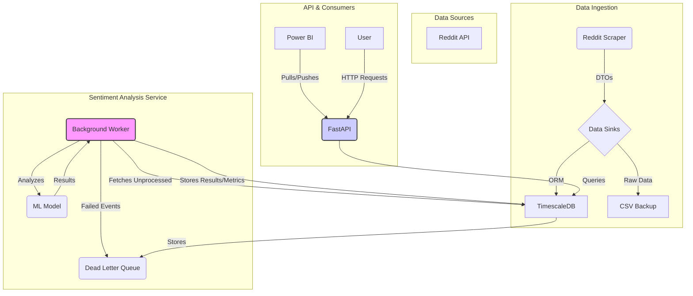

# Sentiment Pipeline Project

**Version:** 1.0.0  
**Status:** Production Ready

This project provides a complete, end-to-end pipeline for collecting data from sources like Reddit, performing sentiment analysis, and visualizing the results in real-time. The entire stack is containerized using Docker and orchestrated with Docker Compose for easy setup and deployment.

## Table of Contents

- [Project Overview](#project-overview)
- [Live Demo](#live-demo)
- [Architecture](#architecture)
- [Core Features](#core-features)
- [Technology Stack](#technology-stack)
- [Services](#services)
  - [Reddit Scraper](#1-reddit-scraper)
  - [TimescaleDB](#2-timescaledb)
  - [Sentiment Analyzer Service](#3-sentiment-analyzer-service)
- [Getting Started](#getting-started)
- [Project Documentation](#project-documentation)
- [Contributing](#contributing)
- [License](#license)

## Project Overview

The Sentiment Pipeline is designed to:
1.  **Collect:** Fetch Reddit submissions from specified subreddits using the `reddit_scraper` service.
2.  **Store:** Persist the collected time-series data efficiently in a `TimescaleDB` database.
3.  **Analyze:** Process raw text in the background to determine sentiment scores using a dedicated `sentiment_analyzer` service with HuggingFace models.
4.  **Serve:** Expose sentiment data and metrics via a robust FastAPI application.
5.  **Visualize:** Present real-time and historical data through Power BI dashboards using a hybrid streaming and DirectQuery model.

## Live Demo

Real-time and historical sentiment are visualized in Power BI. See [`sentiment_docs/POWERBI.md`](sentiment_docs/POWERBI.md) for setup instructions to connect to the service and build dashboards.

## Architecture



For a detailed explanation of the project architecture, data models, and component interactions, please see the **[Project Documentation Index](DOCUMENTATION.md)**.

## Core Features

- **Modular Microservices**: Independent services for scraping, analysis, and serving.
- **High-Performance Database**: TimescaleDB for efficient time-series data storage and querying.
- **Automated Sentiment Analysis**: Background pipeline processes new data automatically.
- **Robust API**: FastAPI application for querying results and metrics, with pagination and filtering.
- **Real-time Visualization**: Hybrid Power BI integration for live streaming and historical analysis.
- **Containerized & Deployable**: Fully containerized with Docker and ready for production deployment.
- **Automated Migrations**: Database schema managed by Alembic.

## Technology Stack

- **Backend**: Python, FastAPI, SQLAlchemy
- **Database**: PostgreSQL, TimescaleDB
- **ML/NLP**: PyTorch, HuggingFace Transformers
- **Containerization**: Docker, Docker Compose
- **Migrations**: Alembic
- **Visualization**: Power BI

## Services

### 1. Reddit Scraper
- **Directory:** `reddit_scraper/`
- **Purpose:** Fetches Reddit submissions from configurable subreddits.
- **Documentation:** See `reddit_scraper/README.md`.

### 2. TimescaleDB
- **Directory:** `timescaledb/`
- **Purpose:** Stores all collected time-series data in hypertables.
- **Documentation:** See [`timescaledb_integration_guide.md`](timescaledb_integration_guide.md).

### 3. Sentiment Analyzer Service
- **Directory:** `sentiment_analyzer/`
- **Purpose:** Performs sentiment analysis and serves results via a FastAPI.
- **Documentation:** See `sentiment_docs/design.md` and `sentiment_docs/API_EXAMPLES.md`.

## Getting Started

Follow these steps to get the entire Sentiment Pipeline project up and running. For detailed instructions, refer to [`sentiment_docs/DEPLOYMENT.md`](sentiment_docs/DEPLOYMENT.md).

### 1. Prerequisites
- [Docker](https://www.docker.com/get-started) & [Docker Compose](https://docs.docker.com/compose/install/)
- [Git](https://git-scm.com/)

### 2. Clone the Repository
```bash
git clone <repository_url>
cd sentiment_pipeline
```

### 3. Environment Configuration
The project uses a single `.env` file to manage configuration for all services.
```bash
cp .env.example .env
```
**Edit `.env`** and set your database credentials, API configurations, and any other required values. Refer to `.env.example` for a full list of variables.

### 4. Build and Run with Docker Compose
This command will build the images for all services and start the containers. The `sentiment_analyzer` service will automatically handle database migrations on startup.
```bash
docker-compose up -d --build
```

### 5. Verify the Deployment
- **Check container status:** `docker-compose ps`
- **View logs:** `docker-compose logs -f sentiment_analyzer`
- **Access the API docs (if not in production):** `http://localhost:8001/docs`

## Project Documentation

All project documentation is indexed in **[`DOCUMENTATION.md`](DOCUMENTATION.md)**. This is the best place to start to find information about the project's architecture, design, deployment, and usage.

## Contributing

Contributions are welcome! Please follow standard Git workflow (fork, branch, pull request).

## License

This project is licensed under the MIT License.
