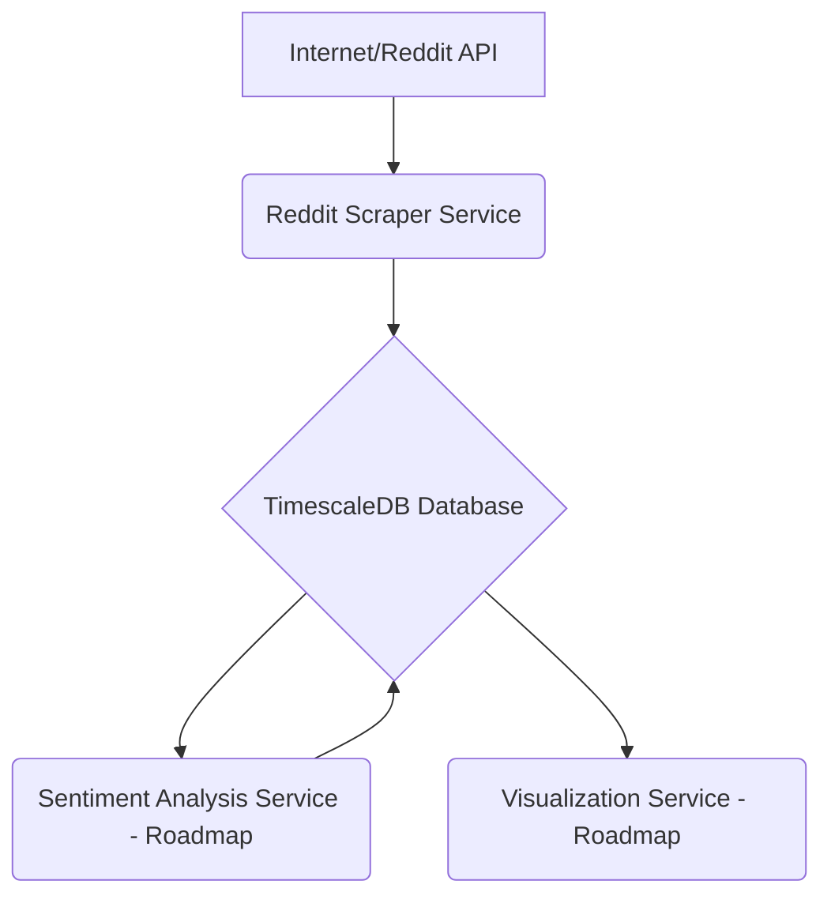

# Sentiment Pipeline Project

**Version:** 0.1.0
**Status:** In Development

This project aims to build a comprehensive pipeline for collecting data from Reddit, performing sentiment analysis, and visualizing the results. Currently, it includes a Reddit scraper and a TimescaleDB database for storing the collected data.

## Table of Contents

-   [Project Overview](#project-overview)
-   [Architecture](#architecture)
-   [Services](#services)
    -   [Reddit Scraper](#1-reddit-scraper)
    -   [TimescaleDB](#2-timescaledb)
    -   [Sentiment Analysis Service (Roadmap)](#3-sentiment-analysis-service-roadmap)
    -   [Visualization Service (Roadmap)](#4-visualization-service-roadmap)
-   [Prerequisites](#prerequisites)
-   [Getting Started](#getting-started)
    -   [1. Clone the Repository](#1-clone-the-repository)
    -   [2. Environment Configuration](#2-environment-configuration)
    -   [3. Build and Run with Docker Compose](#3-build-and-run-with-docker-compose)
    -   [4. Initial Database Setup (TimescaleDB with Alembic)](#4-initial-database-setup-timescaledb-with-alembic)
-   [Usage](#usage)
-   [Project Structure](#project-structure)
-   [Contributing](#contributing)
-   [License](#license)

## Project Overview

The Sentiment Pipeline is designed to:
1.  **Collect:** Fetch Reddit submissions from specified subreddits using the `reddit_scraper` service.
2.  **Store:** Persist the collected time-series data efficiently in a `TimescaleDB` database, optimized for large volumes and time-based queries.
3.  **Analyze (Roadmap):** Process the stored data to determine sentiment scores using a dedicated `sentiment_analysis_service`.
4.  **Visualize (Roadmap):** Present the data and sentiment analysis results through a `visualization_service` or dashboard.

This project leverages Docker and Docker Compose for easy setup, development, and deployment of its microservices.

## Architecture

The system is designed as a set of containerized microservices communicating over a Docker network. 

-   The **Reddit Scraper** fetches data and sends it to TimescaleDB.
-   **TimescaleDB** acts as the central data store for time-series submission data.
-   Future services for sentiment analysis and visualization will connect to TimescaleDB to read data and potentially write back analytical results.



## Services

### 1. Reddit Scraper

-   **Directory:** `reddit_scraper/`
-   **Description:** A Python application responsible for fetching submissions from configured subreddits using the Reddit API. It handles rate limiting, error management, and data formatting before sending it to the storage backend.
-   **Key Features:** Historical backfilling, continuous monitoring of new posts, configurable subreddits and data fields.
-   **Documentation:** See `reddit_scraper/README.md` and `reddit_scraper/prd.md`.

### 2. TimescaleDB

-   **Directory:** `timescaledb/` (for documentation like PRD, To-Do)
-   **Description:** An instance of TimescaleDB (PostgreSQL extended for time-series data) running in a Docker container. It serves as the primary data store for all Reddit submissions.
-   **Key Features:** Hypertables for automatic time-based partitioning, efficient time-series queries, data persistence.
-   **Documentation:** See `timescaledb/README.md`, `timescaledb/prd.md`, and the `timescaledb_integration_guide.md`.

### 3. Sentiment Analysis Service (Roadmap)

-   **Directory:** `sentiment_service/` (to be created)
-   **Description:** This service will be responsible for consuming raw text data (e.g., submission titles, selftext) from TimescaleDB, performing sentiment analysis using NLP models, and potentially storing the sentiment scores back into the database or a new table.
-   **Status:** Planned. Details will be added as development progresses.

### 4. Visualization Service (Roadmap)

-   **Directory:** `visualization_service/` (to be created)
-   **Description:** This service will provide a way to visualize the collected data and sentiment analysis results, possibly through dashboards or charts (e.g., using Grafana, a custom web app with Plotly/Dash, etc.).
-   **Status:** Planned. Details will be added as development progresses.

## Prerequisites

Before you begin, ensure you have the following installed:

-   [Docker](https://www.docker.com/get-started)
-   [Docker Compose](https://docs.docker.com/compose/install/)
-   [Git](https://git-scm.com/)

## Getting Started

Follow these steps to get the Sentiment Pipeline project up and running.

### 1. Clone the Repository

```bash
git clone <repository_url>
cd sentiment_pipeline
```

### 2. Environment Configuration

This project uses `.env` files to manage configuration and secrets. Example files are provided, which you should copy and customize.

1.  **Docker Compose Environment (`.env`):**
    This file is used by `docker-compose.yml` primarily for configuring the TimescaleDB service.
    ```bash
    cp .env.example .env
    ```
    Edit `.env` and set your desired `PG_USER`, `PG_PASSWORD`, and `PG_DB` for the TimescaleDB instance.

2.  **Reddit Scraper Environment (`scraper.env`):**
    This file configures the `reddit_scraper` service, including database connection details and Reddit API credentials.
    ```bash
    cp scraper.env.example scraper.env
    ```
    Edit `scraper.env`:
    *   Ensure `PG_HOST` is set to `timescaledb` (the service name in `docker-compose.yml`).
    *   Match `PG_DB`, `PG_USER`, `PG_PASSWORD` with the values you set in the root `.env` file for TimescaleDB.
    *   Fill in your Reddit API credentials (`REDDIT_CLIENT_ID`, `REDDIT_CLIENT_SECRET`, etc.).

*(Note: `.env.example` and `scraper.env.example` will need to be created if they don't exist yet. They should list all required variables with placeholder or default values.)*

### 3. Build and Run with Docker Compose

Once the environment files are configured, you can build and start all services:

```bash
docker-compose up -d --build
```

-   `--build`: Forces Docker to rebuild images if there are changes (e.g., in a `Dockerfile` or application code).
-   `-d`: Runs containers in detached mode.

To check the status of your containers:
```bash
docker-compose ps
```

To view logs:
```bash
docker-compose logs -f           # All services
docker-compose logs -f reddit_scraper # Specific service
docker-compose logs -f timescaledb   # Specific service
```

### 4. Initial Database Setup (TimescaleDB with Alembic)

This section outlines the steps to initialize the TimescaleDB instance and apply database schema migrations using Alembic. Alembic will handle the creation of tables, enabling the TimescaleDB extension, and setting up hypertables.

**Prerequisites:**

*   The TimescaleDB Docker container (service name `timescaledb` in `docker-compose.yml`) is running.
*   Docker and Docker Compose are installed.

**Steps:**

1.  **Ensure TimescaleDB is Running:**
    *   Start all services, including TimescaleDB:
        ```bash
        docker-compose up -d timescaledb
        ```
    *   Allow a few moments for the database service to initialize.

2.  **Apply Alembic Migrations:**
    *   Alembic migrations define and apply schema changes to the database. This includes creating tables (e.g., `raw_submissions`), enabling the `timescaledb` extension, and converting tables to hypertables.
    *   To apply all pending migrations, run the following command. This command is typically executed from a service that has Alembic and your project's SQLAlchemy models installed (e.g., the `reddit_scraper` service, or a dedicated Alembic service if you configure one).
        ```bash
        docker-compose exec reddit_scraper alembic upgrade head
        ```
        *(Note: If you create a separate service for Alembic tasks, replace `reddit_scraper` with that service name.)*

3.  **Verify Setup (Optional):**
    *   You can connect to the TimescaleDB instance to verify that the tables and hypertables have been created correctly.
    *   Connect using `psql` via Docker exec:
        ```bash
        docker-compose exec timescaledb psql -U <your_timescaledb_user> -d <your_timescaledb_database>
        ```
        (Replace `<your_timescaledb_user>` and `<your_timescaledb_database>` with values from your `.env` file, e.g., `PG_USER` and `PG_DB`).
    *   Inside `psql`, you can check:
        ```sql
        -- List tables (should include raw_submissions or similar)
        \dt

        -- Check if TimescaleDB extension is active
        \dx timescaledb

        -- List hypertables (should show raw_submissions as a hypertable)
        SELECT * FROM timescaledb_information.hypertables;

        -- Describe the hypertable structure
        \d+ raw_submissions
        ```

This Alembic-driven setup ensures that your database schema is version-controlled and applied consistently across different environments.

## Usage

-   Once running, the `reddit_scraper` will automatically start fetching data based on its configuration (see `scraper.env` and `reddit_scraper/config.yaml` if applicable).
-   Data will be stored in the `timescaledb` service.
-   You can connect to TimescaleDB using any PostgreSQL client (e.g., DBeaver, pgAdmin, `psql`) to inspect the data, using the credentials and port (`localhost:5432`) configured.

To stop the application:
```bash
docker-compose down
```
To stop and remove volumes (deletes all database data!):
```bash
docker-compose down -v
```

## Project Structure

```
sentiment_pipeline/
├── .github/                    # GitHub Actions workflows
├── .vscode/                    # VSCode settings
├── alembic/                    # Alembic migration scripts
│   ├── versions/               # Individual migration files
│   └── env.py                  # Alembic environment configuration
│   └── script.py.mako          # Migration script template
├── config/
│   └── base_config.py          # Base Pydantic settings model
├── data/
│   └── processed/              # Processed data (e.g., aggregated sentiment)
│   └── raw/                    # Raw data from scrapers (CSV backups)
├── docs/                       # General project documentation (placeholder)
├── reddit_scraper/
│   ├── .dockerignore
│   ├── Dockerfile
│   ├── README.md               # Reddit scraper specific documentation
│   ├── config.yaml             # Scraper configuration
│   ├── main.py                 # Main application entry point
│   ├── prd.md                  # Product Requirements Document for scraper
│   ├── requirements.txt
│   └── src/
│       └── ...                 # Scraper source code
├── sentiment_analyzer/         # (Future service)
├── timescaledb/
│   ├── Dockerfile              # Dockerfile for TimescaleDB service (if custom)
│   ├── README.md
│   ├── init-db.sh              # Initialization script (if needed beyond Alembic)
│   ├── prd.md                  # Product Requirements Document for TimescaleDB
│   ├── todo.md
│   └── todo_details.md
├── .env.example                # Example environment variables
├── .gitignore
├── alembic.ini                 # Alembic configuration file
├── docker-compose.yml
├── PLANNING.md
├── PRD.md                      # Main Project Product Requirements Document
├── README.md                   # This file
├── TASK.md
├── TODO.md
├── scraper_implementation_rule.md # Rules for all scrapers
└── timescaledb_integration_guide.md # Guide for TimescaleDB integration
```

## Contributing

Contributions are welcome! Please follow standard Git workflow (fork, branch, pull request). (Further details can be added here: coding standards, issue tracking, etc.)

## License

(Specify your project's license here, e.g., MIT, Apache 2.0, etc.)

Example: This project is licensed under the MIT License - see the [LICENSE.md](LICENSE.md) file for details (you would need to create this file).
