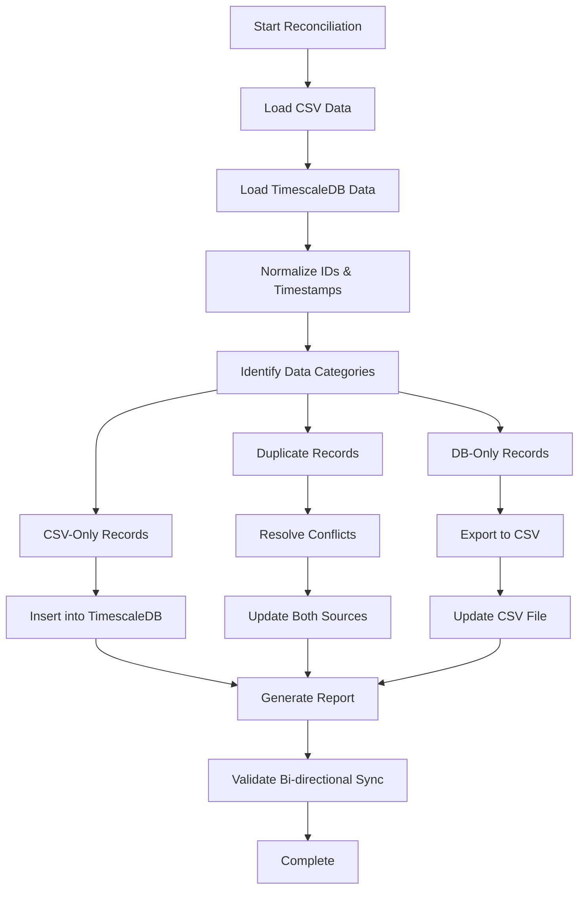

# Data Reconciliation Strategy: TimescaleDB ↔ reddit_finance.csv

**Version:** 1.0  
**Date:** 2025-07-25  
**Project:** Sentiment Pipeline - Reddit Scraper Data Reconciliation

## 1. Executive Summary

This document outlines the strategy for reconciling data between the TimescaleDB `raw_events` table (populated by the reddit_scraper service) and the existing `reddit_finance.csv` file. The goal is to ensure data consistency, eliminate duplicates, and establish a unified data source while maintaining data integrity across both storage systems.

## 2. Current Data Architecture Analysis

### 2.1. TimescaleDB Structure (`raw_events` table)

**Schema:**
- `id` (BIGINT, PK, Auto-increment): Internal database identifier
- `source` (TEXT, NOT NULL): Always 'reddit' for Reddit data
- `source_id` (TEXT, NOT NULL): Reddit submission ID (base36 format)
- `occurred_at` (TIMESTAMPTZ, PK, NOT NULL): Reddit `created_utc` timestamp
- `payload` (JSONB, NOT NULL): Complete Reddit submission data
- `ingested_at` (TIMESTAMPTZ, NOT NULL): When data was stored in DB
- `processed` (BOOLEAN, DEFAULT false): Sentiment analysis status
- `processed_at` (TIMESTAMPTZ, NULL): When sentiment analysis completed

**Key Characteristics:**
- Hypertable partitioned by `occurred_at`
- Composite primary key: `(id, occurred_at)`
- Unique constraint: `(source, source_id, occurred_at)`
- Reddit data stored in JSONB `payload` field
- Source IDs prefixed with 'reddit-scraper-' in some implementations

### 2.2. CSV Structure (`reddit_finance.csv`)

**Schema (matches `SubmissionRecord` TypedDict):**
- `id` (str): Reddit base36 ID
- `created_utc` (int): Unix epoch timestamp
- `subreddit` (str): Subreddit name (lowercase)
- `title` (str): Submission title (UTF-8)
- `selftext` (str): Submission body text (may be empty)
- `author` (str): Reddit username or '[deleted]'
- `score` (int): Upvotes minus downvotes
- `upvote_ratio` (float): Ratio between 0-1
- `num_comments` (int): Comment count at fetch time
- `url` (str): Submission URL
- `flair_text` (str, optional): Post flair
- `over_18` (bool): NSFW flag

**Key Characteristics:**
- Flat CSV structure with direct field mapping
- File size: ~141MB (substantial dataset)
- Chronologically sorted by `created_utc`
- No internal database IDs, uses Reddit IDs directly

## 3. Data Mapping & Transformation Strategy

### 3.1. Field Mapping

| CSV Field | TimescaleDB Field | Transformation Required |
|-----------|-------------------|------------------------|
| `id` | `source_id` | Remove 'reddit-scraper-' prefix if present |
| `created_utc` | `occurred_at` | Convert Unix timestamp to TIMESTAMPTZ |
| All other fields | `payload` → JSON fields | Extract from/insert into JSONB payload |

### 3.2. Key Reconciliation Challenges

1. **ID Format Differences:**
   - CSV uses raw Reddit IDs (e.g., "abc123")
   - TimescaleDB may use prefixed IDs (e.g., "reddit-scraper-abc123")

2. **Data Structure Differences:**
   - CSV: Flat structure with direct columns
   - TimescaleDB: Nested JSONB payload structure

3. **Timestamp Formats:**
   - CSV: Unix epoch integers
   - TimescaleDB: PostgreSQL TIMESTAMPTZ

4. **Duplicate Detection:**
   - Must handle records that exist in both sources
   - Need to identify the authoritative source for conflicts

## 4. Reconciliation Strategy

### 4.1. Data Consistency Principles

1. **Bi-directional Synchronization:** Both TimescaleDB and CSV are kept in sync
2. **Conflict Resolution:** Newer `ingested_at` timestamp wins for duplicates
3. **Data Preservation:** No data loss during reconciliation
4. **Audit Trail:** Log all reconciliation actions for transparency
5. **Format Integrity:** Maintain proper data formats in both storage systems

### 4.2. Bi-directional Reconciliation Process Flow

### 4.3. Enhanced Conflict Resolution Rules

1. **Timestamp Conflicts:** Use the record with the latest `ingested_at` timestamp
2. **Content Conflicts:** Compare field-by-field, prefer non-null values
3. **Missing Fields:** Merge non-null values from both sources
4. **Metadata Preservation:** Keep both `ingested_at` and original CSV timestamp info
5. **Bi-directional Updates:** Apply resolved conflicts to both TimescaleDB and CSV

### 4.4. CSV Export Strategy

**For DB-only records being exported to CSV:**
1. **Payload Extraction:** Convert JSONB payload back to CSV columns
2. **Timestamp Conversion:** Convert PostgreSQL TIMESTAMPTZ to Unix epoch
3. **Data Type Mapping:** Ensure proper CSV data types (string, int, float, bool)
4. **File Integration:** Merge with existing CSV while maintaining chronological order
5. **Backup Creation:** Create timestamped backup before CSV modification

## 5. Data Quality Assurance

### 5.1. Validation Checks

1. **ID Uniqueness:** Ensure no duplicate Reddit IDs after reconciliation
2. **Timestamp Consistency:** Verify `occurred_at` matches `created_utc`
3. **Required Fields:** Validate all mandatory fields are present
4. **Data Type Integrity:** Ensure proper data types after transformation
5. **Referential Integrity:** Verify JSON payload structure consistency

### 5.2. Quality Metrics

- **Coverage:** Percentage of records successfully reconciled
- **Accuracy:** Percentage of records with consistent data across sources
- **Completeness:** Percentage of records with all required fields
- **Timeliness:** Age distribution of reconciled data

## 6. Risk Assessment & Mitigation

### 6.1. Identified Risks

| Risk | Impact | Probability | Mitigation Strategy |
|------|--------|-------------|-------------------|
| Data Loss | High | Low | Full backup before reconciliation |
| Performance Impact | Medium | Medium | Process in batches, off-peak hours |
| Memory Exhaustion | Medium | Medium | Streaming processing, chunked operations |
| Inconsistent State | High | Low | Atomic transactions, rollback capability |
| Service Downtime | Medium | Low | Read-only operations, minimal service impact |

### 6.2. Rollback Strategy

1. **Database Backup:** Full TimescaleDB backup before reconciliation
2. **CSV Versioning:** Create timestamped backup of original CSV
3. **Transaction Logging:** Detailed log of all changes for reversal
4. **Validation Points:** Checkpoints for partial rollback if needed

## 7. Performance Considerations

### 7.1. Optimization Strategies

1. **Batch Processing:** Process records in configurable batch sizes (default: 1000)
2. **Parallel Processing:** Use async operations where possible
3. **Memory Management:** Stream large datasets to avoid memory issues
4. **Index Utilization:** Leverage existing database indexes for lookups
5. **Connection Pooling:** Reuse database connections efficiently

### 7.2. Resource Requirements

- **Memory:** Minimum 4GB RAM for processing large CSV files
- **Storage:** Temporary space equal to 2x largest dataset size
- **CPU:** Multi-core recommended for parallel processing
- **Network:** Stable connection to TimescaleDB instance

## 8. Monitoring & Reporting

### 8.1. Progress Tracking

- Real-time progress indicators for both directions
- Batch completion status (CSV→DB and DB→CSV)
- Error rate monitoring for both sync directions
- Performance metrics (records/second) for each operation

### 8.2. Enhanced Reconciliation Report

The bi-directional process will generate a comprehensive report including:

- **Summary Statistics:** Total records processed, inserted, updated, exported in both directions
- **Data Quality Metrics:** Validation results, error counts for both sources
- **Performance Metrics:** Processing time, throughput rates for each sync direction
- **Conflict Resolution:** Details of resolved conflicts and their resolution method
- **Bi-directional Validation:** Confirmation that both sources are synchronized
- **Recommendations:** Suggested follow-up actions and optimization opportunities

## 9. Post-Reconciliation Actions

### 9.1. Data Validation

1. **Cross-Reference Check:** Verify data consistency between sources
2. **Sampling Validation:** Manual spot-checks of reconciled data
3. **Automated Tests:** Run data quality tests on reconciled dataset
4. **Performance Testing:** Verify query performance on updated dataset

### 9.2. Process Documentation

1. **Update Architecture Docs:** Reflect reconciliation changes
2. **Operational Procedures:** Document ongoing reconciliation processes
3. **Monitoring Setup:** Establish ongoing data consistency monitoring
4. **Training Materials:** Create guides for operational staff

## 10. Future Considerations

### 10.1. Ongoing Bi-directional Synchronization

- **Incremental Updates:** Strategy for ongoing sync in both directions
- **Automated Reconciliation:** Scheduled bi-directional consistency checks
- **Change Detection:** Monitor for data drift between sources in real-time
- **Alert System:** Notifications for data inconsistencies in either direction
- **Conflict Prevention:** Strategies to minimize future conflicts

### 10.2. Scalability Planning

- **Volume Growth:** Handle increasing data volumes in both directions
- **Performance Optimization:** Continuous improvement of bi-directional sync speed
- **Resource Scaling:** Auto-scaling for large reconciliation jobs
- **Multi-Source Support:** Extend to additional data sources beyond CSV
- **Real-time Sync:** Consider event-driven synchronization for near real-time updates

---

**Document Status:** Draft  
**Next Review:** 2025-08-01  
**Owner:** Data Engineering Team
