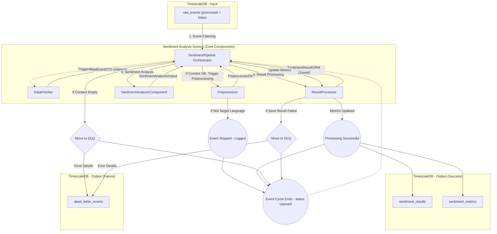

# Lifecycle of a Raw Event in the Sentiment Analysis Service

**Version:** 1.0  
**Date:** 2025-06-09

## 1. Introduction

This document details the journey of a single unprocessed event from the `raw_events` table as it is processed by the Sentiment Analysis Service. It outlines each step, the components involved, potential outcomes, and where the resulting data is stored.

## 2. Assumptions

- A raw event (conforming to `RawEventDTO`/`RawEventORM`) exists in the `raw_events` TimescaleDB hypertable **where `processed` is `FALSE`**.  *(Note: the previous `processing_status` string column has been removed in favour of a simpler boolean flag plus a `processed_at` timestamp – see `reddit_scraper.models.submission.RawEventORM`)*.
- The Sentiment Analysis Service, specifically the `SentimentPipeline` main loop, is running.
- All core components (`DataFetcher`, `Preprocessor`, `SentimentAnalyzerComponent`, `ResultProcessor`) are operational and correctly configured.
- Database connections are available.

## 3. Visual Overview: Event Lifecycle

The following diagram illustrates the flow of a single event through the service:



## 4. Detailed Steps in the Event Lifecycle

Let's assume our specific event is `event_X`.

### Step 1: Event Claiming

- **Orchestrator**: The `SentimentPipeline.main_loop()` is active.
- **Action**: It calls `SentimentPipeline.run_pipeline_once()`.
- **Component**: `run_pipeline_once()` invokes `core.data_fetcher.fetch_and_claim_raw_events(batch_size)`.
- **Database Interaction (`DataFetcher`):
  - An asynchronous database session is acquired.
  - The following conceptual SQL is executed (via SQLAlchemy ORM):
    ```sql
    UPDATE raw_events
    SET processed = TRUE, processed_at = NOW()
    WHERE id = event_X.id AND processed = FALSE  -- Simplified, actual query fetches a batch
    RETURNING *;
    ```
  - `event_X` (and others in the batch) has its `processing_status` changed from `'unprocessed'` to `'claimed'` and `claimed_at` is set.
- **Output**: A list of `RawEventDTO` objects, including `event_X`, is returned to the `SentimentPipeline`.

### Step 2: Preprocessing

- **Orchestrator**: `SentimentPipeline.run_pipeline_once()` iterates through the fetched events. For `event_X`, it calls `SentimentPipeline.process_single_event(event_X)`.
- **Initial Validation (`process_single_event`):
  - Checks if `event_X.content` is null or empty. 
  - **If empty/null**: `event_X` is moved to the `dead_letter_events` table by `ResultProcessor.move_to_dead_letter_queue()`. Lifecycle for `event_X` ends here (Path: DLQ).
- **Component**: `core.preprocessor.Preprocessor.preprocess(event_X.content)` is called.
- **Actions (`Preprocessor`):
  1.  **Language Detection**: `langdetect` identifies the language of `event_X.content`.
  2.  **Target Language Check**: 
      - If detected language is **not** `settings.PREPROCESSOR_TARGET_LANGUAGE` (e.g., not English):
        - `PreprocessedText.is_target_language` is set to `False`.
        - The `cleaned_text` might be the original text or minimally processed.
        - `process_single_event()` logs this and typically ends processing for `event_X` here. No sentiment analysis is performed. (Path: Skipped - Logged).
      - If detected language **is** the target language:
        - `PreprocessedText.is_target_language` is set to `True`.
        - **Text Cleaning**: URLs, emails, mentions, hashtags are removed.
        - **Emoji Handling**: Emojis are converted to textual descriptions (e.g., using `emoji` library).
        - **Normalization**: Text is lowercased, and extra whitespace is removed.
        - **Lemmatization**: Using spaCy (`en_core_web_lg`).
        - **Stop-word Removal**: Using spaCy.
  3.  The `cleaned_text` is produced.
- **Output**: A `PreprocessedText` DTO is returned, containing `cleaned_text`, `detected_language_code`, and `is_target_language`.
- **Post-Preprocessing Check (`process_single_event`):
  - If `PreprocessedText.cleaned_text` is empty (even if it was the target language), this is logged. The current pipeline allows this to flow to the sentiment analyzer, which typically yields a default/neutral sentiment. (Alternatively, this could be a DLQ condition based on stricter rules).

### Step 3: Sentiment Analysis

- **Condition**: This step occurs if `PreprocessedText.is_target_language` was `True` and `cleaned_text` is available.
- **Orchestrator**: `SentimentPipeline.process_single_event()` continues.
- **Component**: `core.sentiment_analyzer_component.SentimentAnalyzerComponent.analyze(preprocessed_data.cleaned_text)` is called.
- **Actions (`SentimentAnalyzerComponent`):
  1.  The `cleaned_text` is tokenized according to the requirements of the loaded sentiment model (e.g., FinBERT - `ProsusAI/finbert`).
  2.  Model inference is performed (utilizing GPU if `settings.MODEL_USE_GPU` is true and CUDA is available).
  3.  The model outputs raw scores/logits for each sentiment class (e.g., positive, neutral, negative).
  4.  These scores are processed (e.g., via softmax) to get probabilities.
  5.  The `label` with the highest probability is chosen, and its probability becomes the `confidence`.
  6.  `model_version` (from settings or model config) is included.
- **Output**: A `SentimentAnalysisOutput` DTO is returned, containing `label`, `confidence`, a dictionary of all `scores`, and `model_version`.

### Step 4: Result Processing & Storage

- **Orchestrator**: `SentimentPipeline.process_single_event()` continues.
- **Component**: `core.result_processor.ResultProcessor` methods are called.

  1.  **Save Individual Sentiment Result**:
      - `ResultProcessor.save_sentiment_result(raw_event=event_X, preprocessed_data=..., sentiment_output=...)` is invoked.
      - **Database Interaction**:
        - An async database session is acquired.
        - A `SentimentResultORM` object is instantiated and populated with data from `event_X`, the `PreprocessedText` DTO, and the `SentimentAnalysisOutput` DTO.
        - The ORM object is added to the session and `session.commit()` is called.
        - **If commit fails** (e.g., DB error, constraint violation not handled by ORM): An exception is caught. `event_X` is moved to `dead_letter_events` via `ResultProcessor.move_to_dead_letter_queue()`. Lifecycle for `event_X` ends here (Path: DLQ).
        - **If commit succeeds**: The saved `SentimentResultORM` object (now with an ID and `processed_at` timestamp) is returned.

  2.  **Update Aggregated Sentiment Metrics**:
      - (Assuming `save_sentiment_result` was successful).
      - `ResultProcessor.update_sentiment_metrics(sentiment_result=saved_orm_object, raw_event_source=event_X.source)` is invoked.
      - **Database Interaction**:
        - An async database session is acquired.
        - For relevant metrics (e.g., `event_count` for the determined `sentiment_label` and `model_version`, `confidence_sum`):
          - An `INSERT ... ON CONFLICT DO UPDATE` statement (via SQLAlchemy ORM) is executed for the `sentiment_metrics` table. This atomically increments the `metric_value` for the corresponding aggregation group (defined by `metric_timestamp`, `raw_event_source`, `sentiment_label`, `model_version`, `metric_name`).
          - Example for `event_count`:
            ```sql
            INSERT INTO sentiment_metrics (metric_timestamp, raw_event_source, sentiment_label, model_version, metric_name, metric_value)
            VALUES (:bucket, :source, :label, :model, 'event_count', 1)
            ON CONFLICT (metric_timestamp, raw_event_source, sentiment_label, model_version, metric_name)
            DO UPDATE SET metric_value = sentiment_metrics.metric_value + EXCLUDED.metric_value;
            ```
        - **If update fails**: This is typically logged as a warning. The primary sentiment result is already saved, so this failure usually doesn't move `event_X` to the DLQ. The processing of `event_X` is still considered largely successful.

### Step 5: Post-Processing and Loop Continuation

- **Orchestrator**: `SentimentPipeline.process_single_event(event_X)` completes and returns `True` (for success/skip) or `False` (for DLQ).
- `SentimentPipeline.run_pipeline_once()` collects results for all events in the batch and logs a summary (total fetched, successful, DLQ'd).
- `SentimentPipeline.main_loop()` then sleeps for `settings.PIPELINE_RUN_INTERVAL_SECONDS` before initiating a new cycle to fetch another batch of events.
- **Status of `event_X` in `raw_events` table**: After this cycle, `raw_events.processed` remains `TRUE`. The current pipeline implementation does not update it to `'processed'` or `'failed'` in the `raw_events` table itself. Future queries by the `DataFetcher` will ignore it because it's no longer `'unprocessed'`.

## 5. Possible Final States for `event_X`

1.  **Successfully Processed and Stored**:
    - A new record exists in `sentiment_results` for `event_X`.
    - Relevant counters in `sentiment_metrics` are updated.
    - `raw_events.processed` for `event_X` is `TRUE`.
    - `raw_events.processing_status` for `event_X` is `'claimed'`.

2.  **Skipped (e.g., Non-Target Language)**:
    - No new record in `sentiment_results` or `sentiment_metrics` related to `event_X`'s sentiment.
    - A log message indicates the skip reason.
    - `raw_events.processing_status` for `event_X` is `'claimed'`.

3.  **Sent to Dead Letter Queue (DLQ)**:
    - A new record exists in `dead_letter_events` detailing `event_X`, the failure reason, stage, and (if available) traceback.
    - No new record in `sentiment_results` or `sentiment_metrics` for `event_X`.
    - `raw_events.processing_status` for `event_X` is `'claimed'`.

## 6. Conclusion

The journey of a raw event through the Sentiment Analysis Service is a multi-stage process designed for robustness. Each component plays a specific role, from data acquisition and cleaning to analysis and storage. Error handling and logging are integrated at various points, with a dead-letter queue mechanism to capture events that cannot be processed, ensuring that the pipeline can continue operating smoothly while preserving problematic data for later review. The final status of the event in the `raw_events` table is `'claimed'`, effectively removing it from future processing batches by this service.
